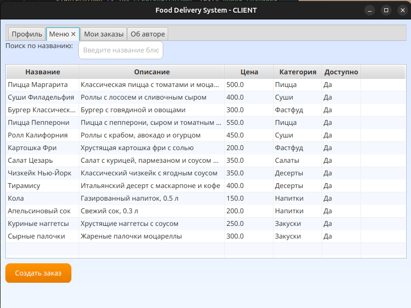

# 🍽️ Информационная система службы доставки еды

Современная и удобная **информационно-справочная система** для управления заказами, доставкой и администрированием службы доставки еды. Разработана в рамках курсовой работы с использованием графического интерфейса JavaFX и мощного серверного стека.

---

## 🚀 Возможности

- **Авторизация пользователей**  
  Безопасный вход для четырех ролей: **Клиент**, **Курьер**, **Менеджер** и **Администратор**. Пароли хэшируются для защиты данных, доступ возможен только после авторизации.

- **Роли и функционал**  
  - **Клиент**: Просмотр меню, создание заказов, отслеживание доставки, история заказов.  
  - **Курьер**: Управление назначенными заказами, обновление статусов доставки.  
  - **Менеджер**: Контроль заказов, редактирование меню, мониторинг активности.  
  - **Администратор**: Полный доступ, включая управление ролями пользователей.

- **Управление данными**  
  - Данные отображаются в удобных таблицах с поддержкой **сортировки** (по дате, статусу, цене) и **поиска** (по имени клиента, адресу, статусу).  
  - Полный набор **CRUD-операций**: создание, просмотр, редактирование и удаление заказов, блюд и пользователей с учетом целостности данных.

- **Статистика**  
  - Подсчет общего числа пользователей и заказов.  
  - Расчет среднего времени доставки.  
  - Визуальная **гистограмма** распределения заказов по статусам.

- **Обработка ошибок**  
  - Информативные всплывающие окна для ошибок (например, «Неверный логин или пароль»).  
  - Проверка корректности ввода данных для предотвращения сбоев.

- **Страница «Об авторе»**  
  Отдельный раздел с информацией об авторе, сроках разработки и использованных технологиях.

---

## 🛠️ Технологический стек

- **Java 21**: Основа для клиентской и серверной логики.  
- **JavaFX**: Интуитивный графический интерфейс с современным дизайном.  
- **Spring Boot**: REST API для серверной части.  
- **Hibernate**: Удобное взаимодействие с базой данных через ORM.  
- **MySQL**: Хранение данных о пользователях, заказах и блюдах.

---

## 📋 Структура базы данных

Система использует MySQL с основными таблицами:

- **users**: Данные пользователей (логин, пароль, роль и др.).  
- **roles**: Роли пользователей (Клиент, Курьер, Менеджер, Админ).  
- **dishes**: Каталог блюд (название, цена, категория, доступность).  
- **orders**: Информация о заказах (пользователь, дата, статус, адрес).  
- **order_dishes**: Связь заказов и блюд с указанием количества.

---

## 🖼️ Скриншоты

- **Меню клиента**  
  

---

### Автор
  Имя: Параева Елена

  Группа: ДПИ22-2

  Учебное заведение: Финансовый Университет
